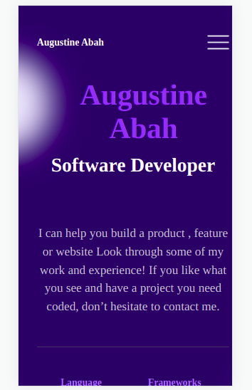

# I designed the mobile menu for the milestone project.

> The project is to design the mobile menu and make it work with java script.

## Built With

- HTML, CSS and Java Script.

## Getting Started

**This is an example of how you may give instructions on setting up your project locally.**
**I wrote the code on HTML and CSS then added linter configuration files **

## Author

👤 **Augustine Stephen Abah**

- GitHub: [@githubhandle](https://github.com/ababaug)
- Twitter: [@twitterhandle](https://twitter.com/twitterhandle)
- LinkedIn: [LinkedIn](https://www.linkedin.com/in/augustine-abah-862202161)

## 🤝 Contributing

Contributions, issues, and feature requests are welcome!

Feel free to check the [issues page](../../issues/).

## Show your support

Give a ⭐️ if you like this project!

## Acknowledgments

## 📝 License

This project is [MIT](./MIT.md) licensed.